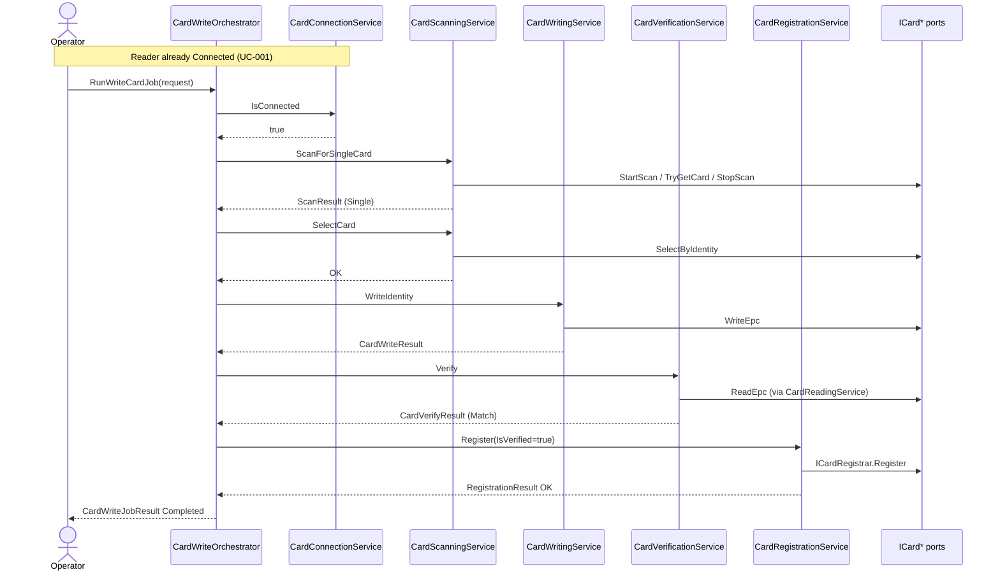
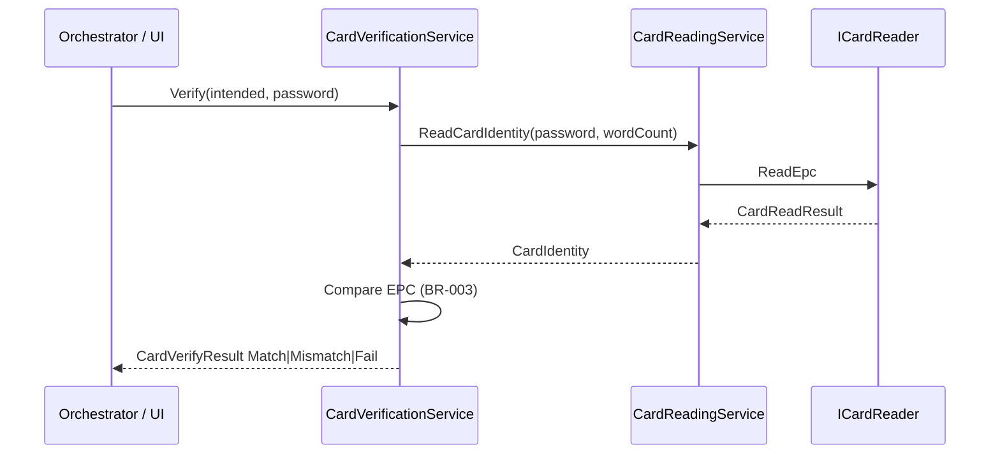
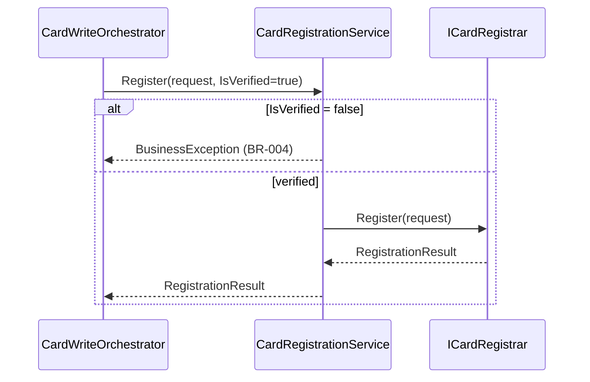

# Application Sequence — Phase 6C

**Related:** [ApplicationWorkflow.md](ApplicationWorkflow.md), Services under `Application/Services`

---

## Write Card (happy path)



---

## Verify only (UC-008)



---

## Register (UC-009)



---

## Register fail after verify

```mermaid
sequenceDiagram
    participant Orch as CardWriteOrchestrator
    participant Reg as CardRegistrationService

    Note over Orch: Write OK + Verify Match already done
    Orch->>Reg: Register(...)
    Reg-->>Orch: Success=false
    Orch-->>Orch: Stage = WrittenButUnregistered (BR-009)
    Note over Orch: No rewrite; Operator may retry register only
```
