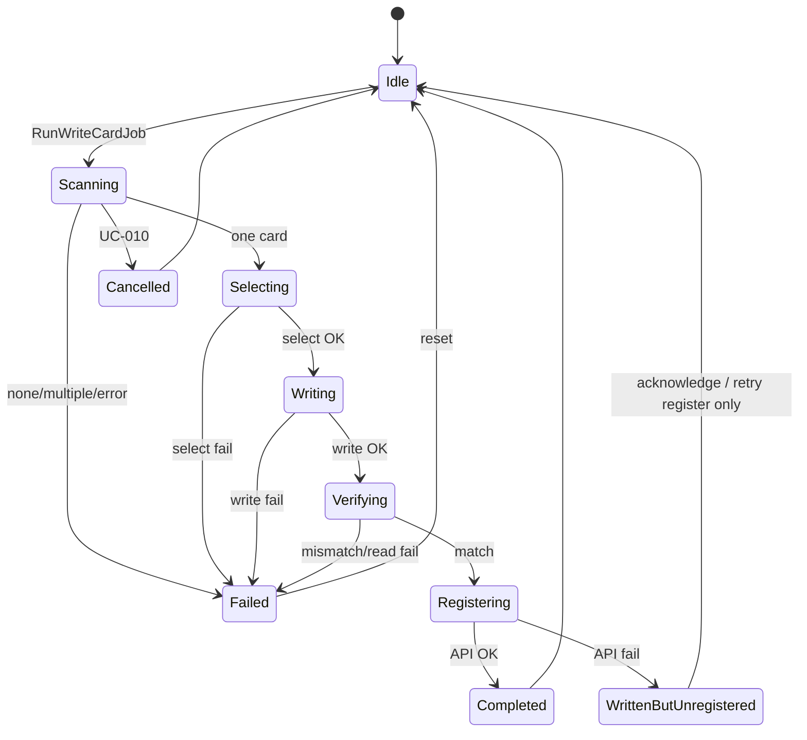

# Application State Machine — CareHR Card Write Job

**Phase:** 6C  
**Related:** [ApplicationWorkflow.md](ApplicationWorkflow.md), `CardWriteJobStage`

---

## Reader session states

```text
Disconnected
    ↓ UC-001 Connect success
Connected / Idle
    ↓ UC-002 Disconnect
Disconnected
```

---

## Write job states (`CardWriteJobStage`)

```text
Idle
  ↓ RunWriteCardJob (reader Connected)
Scanning          (UC-004)
  ↓ one card
Selecting         (UC-005)
  ↓ select OK
Writing           (UC-007)
  ↓ write OK
Verifying         (UC-008)
  ↓ match
Registering       (UC-009)
  ↓ API OK
Completed

Verifying mismatch / read fail → Failed (no register)
Writing fail → Failed (no register)
Scanning fail / multiple → Failed
Register API fail after verify → WrittenButUnregistered
Cancel (UC-010) → Cancelled
```

---

## Mermaid



---

## Notes

- Connect/Disconnect are owned by `CardConnectionService` (outside the job stage enum when already Connected).
- Lock/Kill optional states are out of MVP state machine (UC-011/012 deferred).
