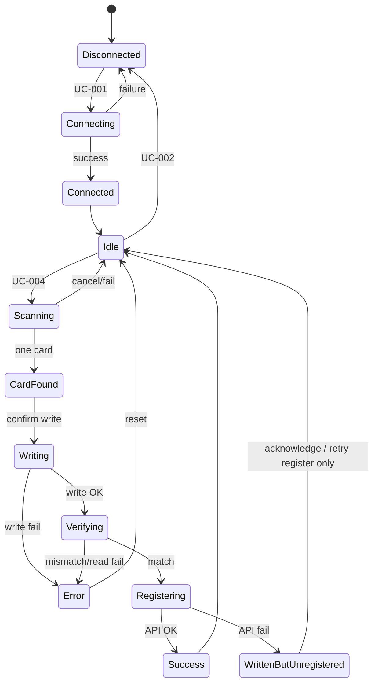
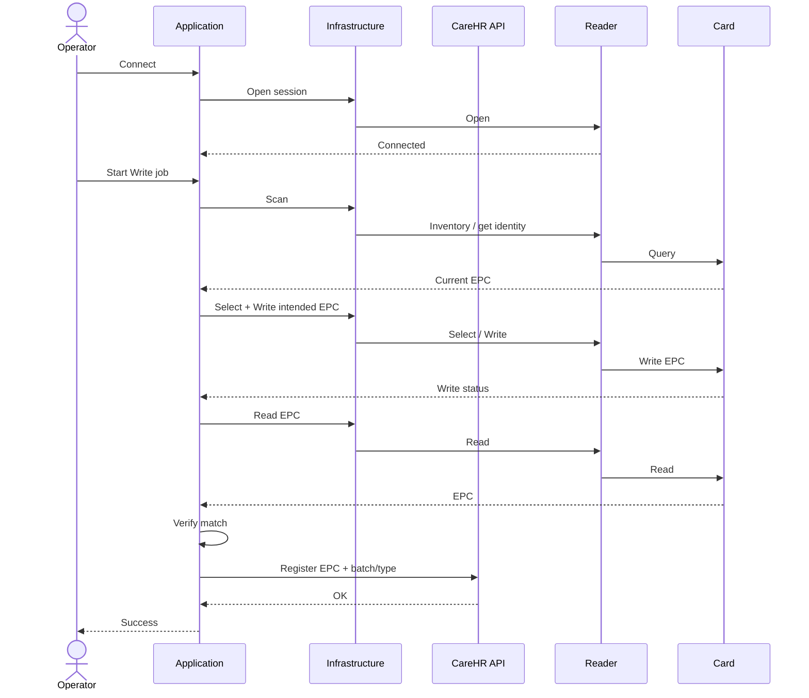

# Application Workflow — CareHR Card Write

**Phase:** 6A  
**Primary happy path:** Operator issues one CareHR UHF card  
**Related:** [ApplicationUseCases.md](ApplicationUseCases.md)

---

## Happy path (MVP)

```text
Connect Reader (UC-001)
        ↓
Discover Readers optional (UC-003)
        ↓
Scan Card (UC-004) ──► exactly one EPC
        ↓
Select Card (UC-005)
        ↓
[Build intended EPC from CareHR business input — Application rule]
        ↓
Write Card (UC-007)
        ↓
Verify Card (UC-008) ── read-back == intended
        ↓
Register Card (UC-009) ── CareHR API
        ↓
Complete (Idle / Success)
```

Optional after verify (product decision): Lock Card (UC-011).

---

## State overview (UI / Application)



---

## Error branches

| Step | Failure | Recovery |
|------|---------|----------|
| Connect | Open fail | Stay Disconnected; message; retry connect |
| Scan | No card / timeout | Idle; ask present card |
| Scan | Multiple EPCs | Idle; ask leave one card |
| Select | Fail | Abort write; Idle |
| Write | Device/password/lock | Idle; **do not** register |
| Verify | Mismatch / read fail | Idle; **do not** register; may retry write per policy |
| Register | API fail after verify | **WrittenButUnregistered** — offer Retry Register only (do not rewrite unless Operator chooses) |
| Any long op | Cancel (UC-010) | Stop inventory; Idle; no register |

---

## Non-goals in workflow

- Continuous multi-tag inventory portal  
- Writing without verify  
- Register before verify  
- MIFARE trailer/auth steps  

---

## Sequence (happy path, logical)


