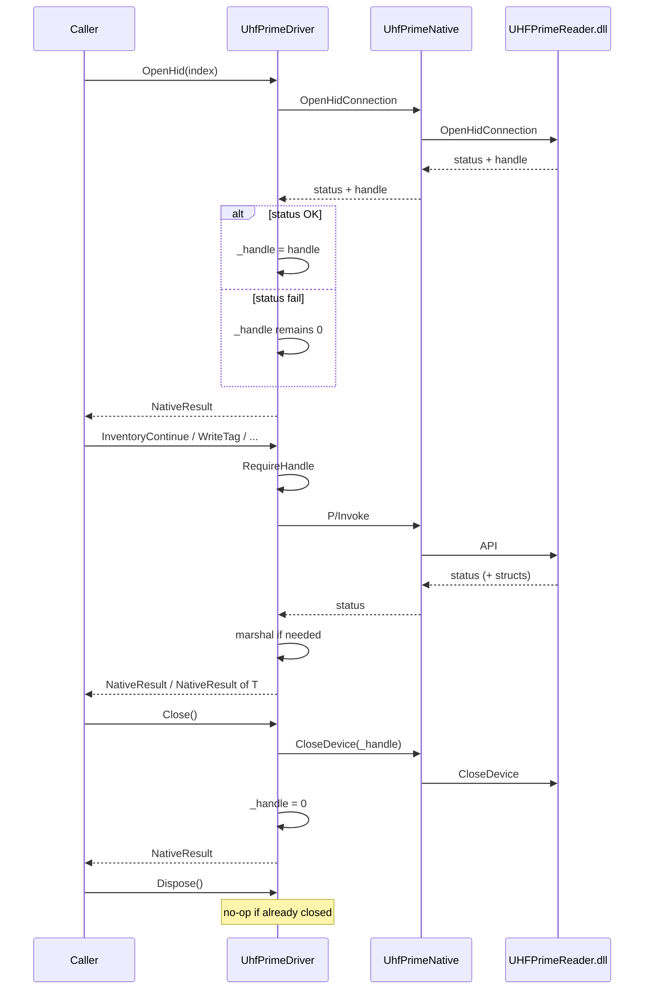
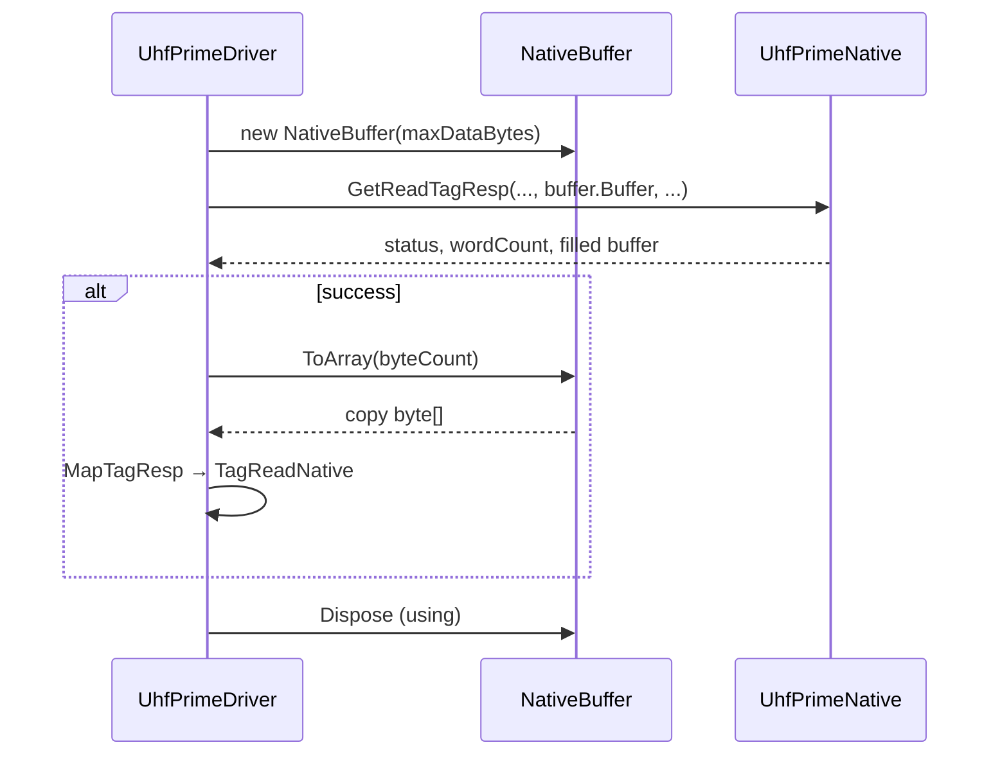

# Resource Lifetime — Driver

**Phase:** 3  
**Types:** `UhfPrimeDriver`, `NativeBuffer`  
**Related:** [ADR-003](adr/ADR-003-Handle-Management.md), [NativeBufferPolicy.md](NativeBufferPolicy.md)

---

## Handle lifetime

| State | `_handle` | `IsOpen` |
|-------|-----------|----------|
| New / after failed Open / after Close / after Dispose | `IntPtr.Zero` | `false` |
| After successful Open* | non-zero | `true` |

**Ownership:** Only `UhfPrimeDriver` owns the handle. Never returned publicly.

**Acquisition:** `OpenDevice` / `OpenHid` / `OpenNet` store handle **only if** status == OK.

**Release:**

1. Preferred: `Close()` → `CloseDevice` → clear handle → return status  
2. `Dispose()` → best-effort `CloseDevice` → clear handle → mark disposed (no throw)

**Rule:** Do not leak: every successful Open must eventually Close or Dispose.

---

## Buffer lifetime

| Buffer | Lifetime |
|--------|----------|
| IN `byte[]` from caller | Owned by caller; pinned only for P/Invoke duration |
| `NativeBuffer` | Created in `GetReadTagResp`, disposed in `using` before return |
| OUT payload in `TagReadNative.Data` | Independent copy; caller owns after return |
| `StringBuilder` in `GetHidUsbInfo` | Local; string copied out |

No `AllocHGlobal` today → no unmanaged free paths in Driver.

---

## Dispose / using

```csharp
using var driver = new UhfPrimeDriver();
var open = driver.OpenHid(0);
// ... single-call APIs ...
driver.Close(); // optional if using Dispose
```

| API | Notes |
|-----|-------|
| `IDisposable` | Supported |
| Idempotent Dispose | Yes |
| Finalizer | None — callers must Dispose/using |

---

## Sequence — open / operate / close



---

## Sequence — GetReadTagResp buffer



---

## Lifetime hazards (documented, not changed)

| Hazard | Severity | Notes |
|--------|----------|-------|
| `Close()` clears handle even if `CloseDevice` returns error | Medium | May orphan native resources if SDK reports fail but still needs retry — report only |
| Forget Dispose after successful Open | High for process | Use `using` |
| Use after Dispose | Guarded | `ObjectDisposedException` |
