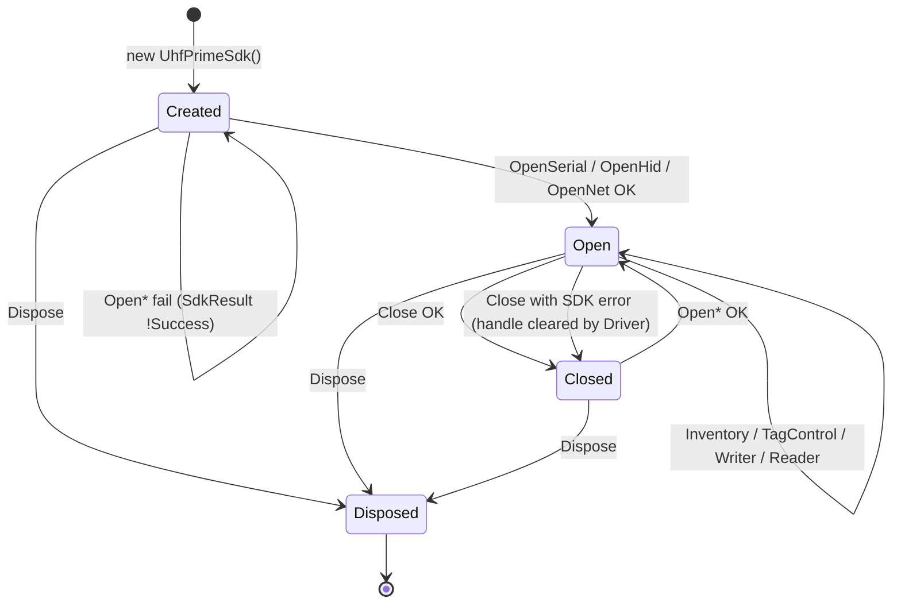
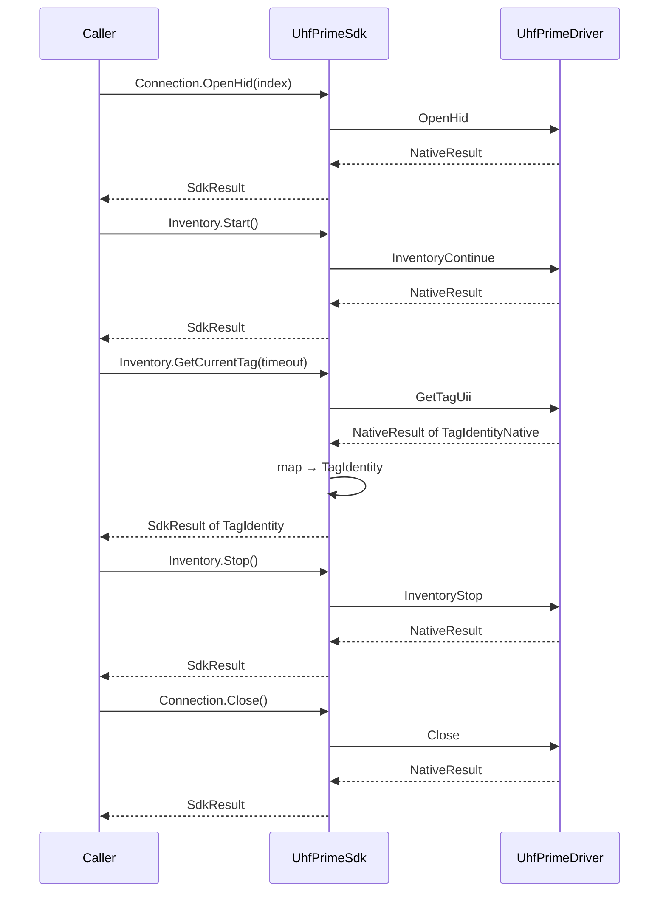
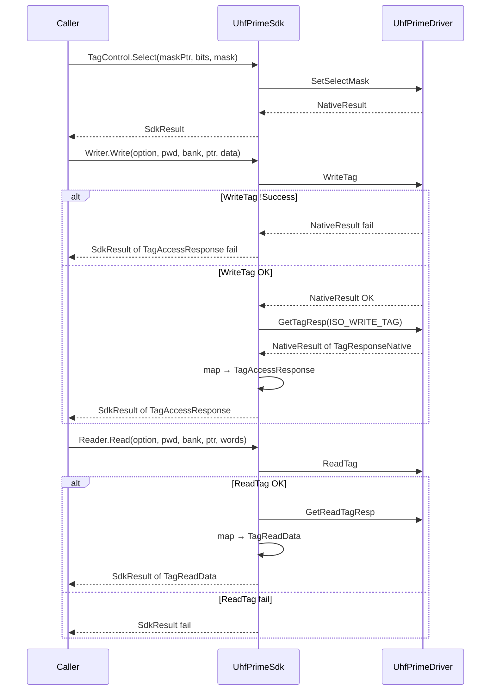
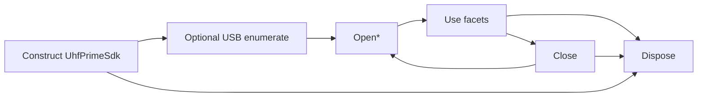
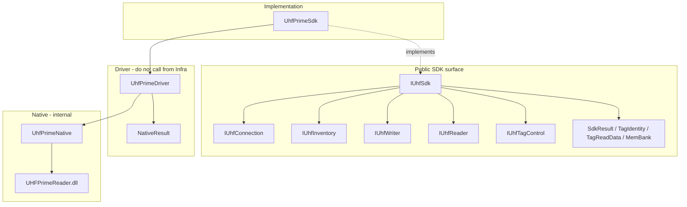

# SDK Wrapper Readiness Review

**Phase:** 4  
**Date:** 2026-08-06  
**Entry:** `IUhfSdk` / `UhfPrimeSdk`  
**Sources:** Implementation in `CareHR.UhfCardWriter.Sdk`; [SDKWrapperContract.md](SDKWrapperContract.md), [SDKWrapperDependencyMap.md](SDKWrapperDependencyMap.md), [SDKWrapperReview.md](SDKWrapperReview.md)

**Verdict:** Wrapper is ready for Infrastructure (Phase 6) and Application interfaces (Phase 5) to consume `IUhfSdk` only.

---

## 1. Interface Contract

Public surface (no Driver / Native types):

| Interface | Key members | Returns | Throws (non-status) |
|-----------|-------------|---------|---------------------|
| `IUhfSdk` | `Connection`, `Inventory`, `Writer`, `Reader`, `TagControl`, `Dispose` | facets | `ObjectDisposedException` after dispose |
| `IUhfConnection` | `IsOpen`, `OpenSerial`, `OpenHid`, `OpenNet`, `Close`, `GetUsbDeviceCount`, `GetUsbDeviceInfo` | `SdkResult` / `SdkResult<T>` | `Argument*`, `SdkException`, `ObjectDisposedException` |
| `IUhfInventory` | `Start`, `Stop`, `GetCurrentTag` | `SdkResult` / `SdkResult<TagIdentity>` | `SdkException`, `ObjectDisposedException` |
| `IUhfWriter` | `Write` | `SdkResult<TagAccessResponse>` | `Argument*` (via Driver), `SdkException`, `ObjectDisposedException` |
| `IUhfReader` | `Read` | `SdkResult<TagReadData>` | same |
| `IUhfTagControl` | `Select`, `Lock`, `Kill` | `SdkResult` | same |

### Contract rules

| Rule | Requirement |
|------|-------------|
| Hide Driver | Consumers use `IUhfSdk` only; do not call `UhfPrimeDriver` |
| Hide Native | No `IntPtr`, no native structs, no `NativeResult` |
| No business | No verify, EPC policy, HTTP, UI |
| No retry / logging | Caller owns policy |
| No polling loop | `GetCurrentTag` = one poll; `Start`/`Stop` = one call each |
| Write pairing | `Write` = `WriteTag` then `GetTagResp` only if write succeeds |
| Read pairing | `Read` = `ReadTag` then `GetReadTagResp` only if read succeeds |

Full prose contracts: [SDKWrapperContract.md](SDKWrapperContract.md).

---

## 2. State Model

Wrapper holds **minimal** state. Inventory “running” and selected EPC are **not** modeled.

| State | `IsOpen` | Allowed operations |
|-------|----------|-------------------|
| Created / Closed | `false` | USB helpers; Open*; Dispose |
| Open | `true` | Inventory, Select, Write, Read, Lock, Kill, Close, Dispose |
| Disposed | N/A | None — `ObjectDisposedException` |

| Field | Owner | Notes |
|-------|-------|-------|
| Device handle | Driver (private) | Never exposed |
| `_ownsDriver` / `_disposed` | `UhfPrimeSdk` | Dispose semantics |
| Inventory running | **Not stored** | Caller may track |
| Select mask / last EPC | **Not stored** | Application concern |

---

## 3. Sequence Diagram

### 3.1 Connect → single inventory poll → disconnect

### 3.2 Select → Write (paired) → Read (paired)

**Not in Wrapper sequences:** verify compare, inventory poll loop, retry, HTTP, InventoryStop inside Write.

---

## 4. Lifecycle

| Step | Behavior |
|------|----------|
| Construct | Creates owned `UhfPrimeDriver` |
| Open* | Driver stores handle only on status OK |
| Close | Preferred when status must be observed |
| Dispose | Idempotent; disposes owned Driver (best-effort close); does not throw |
| After Dispose | All facet calls → `ObjectDisposedException` |

---

## 5. Dependency Graph

Method-level map: [SDKWrapperDependencyMap.md](SDKWrapperDependencyMap.md).

---

## 6. Result Policy

| Outcome | Mechanism |
|---------|-----------|
| Vendor / device / tag status (`STAT_*`) | `SdkResult` / `SdkResult<T>` — **never thrown** |
| Success | `Success == true` ⇔ `StatusCode == 0` |
| Payload | Use `Value` only when `Success` |
| Invalid arguments | `ArgumentNullException` / `ArgumentException` / `ArgumentOutOfRangeException` |
| Not open / already open / marshal hard fail | `SdkException` (from `NativeException`) |
| Disposed | `ObjectDisposedException` |
| Missing DLL / bad image | CLR exceptions (`DllNotFoundException`, etc.) — not wrapped |

### Translation

| Driver | Wrapper |
|--------|---------|
| `NativeResult` | `SdkResult` (status, success, message) |
| `NativeResult<TNativeDto>` | `SdkResult<TSdkModel>` |
| `NativeException` | `SdkException` |
| `Argument*` | Pass through |

### Paired-call policy (Write / Read)

1. First Driver call fails → return that status; **do not** call response API.  
2. First succeeds, second fails → return second status; first command may have been accepted by module (caller decides recovery).  
3. No automatic retry.

---

## 7. Thread Safety

| Question | Answer |
|----------|--------|
| Is Wrapper thread-safe? | **No** |
| SDK instances per reader session | **One** |
| Driver instances per SDK | **One** |
| Concurrent calls on same instance | **Undefined** — must serialize |
| Different SDK instances | Separate Drivers; device sharing is SDK/vendor-dependent — avoid |

**Caller duty (Infrastructure):** dedicated worker thread or external lock around all `IUhfSdk` use for one reader.  
No `lock` / `SemaphoreSlim` inside Wrapper (aligned with ADR-004).

---

## 8. Unit Test Plan

Scope: **Wrapper behavior** without requiring hardware where possible. Fake/mock Driver via `internal` ctor (`UhfPrimeSdk(driver, ownsDriver)`) + InternalsVisibleTo test project (when added).

### 8.1 No-hardware / smoke (existing)

| Case | Expect |
|------|--------|
| `GetUsbDeviceCount` | Returns `SdkResult<int>` without throw |
| `Inventory.Start` while closed | `SdkException` |
| `OpenSerial` invalid COM | `SdkResult.Success == false` |
| Dispose then call | `ObjectDisposedException` |
| Public API types | No `NativeResult` / `IntPtr` in return types |

Tool: `tools/Archive/Phase4Smoke` _(removed — [ToolsHistory.md](ToolsHistory.md))_.

### 8.2 Mapping / result (unit, mock Driver)

| Case | Expect |
|------|--------|
| Driver Open OK | `SdkResult.Success` |
| Driver Open fail status | Same `StatusCode`/`Message` on `SdkResult` |
| `GetCurrentTag` success | `TagIdentity` fields copied (EPC/CRC/PC) |
| `Write`: WriteTag fail | No GetTagResp; fail `SdkResult` |
| `Write`: WriteTag OK, GetTagResp fail | Fail with GetTagResp status |
| `Write`: both OK | `TagAccessResponse` populated |
| `Read`: ReadTag fail | No GetReadTagResp |
| `Read`: both OK | `TagReadData.Data` length consistent with wordCount |
| `NativeException` from Driver | `SdkException` with inner |

### 8.3 Validation pass-through

| Case | Expect |
|------|--------|
| Null password / odd write length / bad memBank | `Argument*` before native (Driver validation) |
| Null select mask | `ArgumentNullException` |

### 8.4 Explicit non-tests for Wrapper

| Out of scope | Owner |
|--------------|-------|
| Inventory poll until one tag | Application / InventoryService |
| Verify EPC match | VerifyService |
| Retry / reconnect policy | Later phases |
| Hardware RF integration | Device tests |

---

## 9. Technical Debt

| ID | Item | Impact | Recommendation | Blocker? |
|----|------|--------|----------------|----------|
| W-TD-01 | `UhfPrimeDriver` still `public` | Low — convention leak risk | Future ADR: make Driver `internal` | No |
| W-TD-02 | No `IUhfPower` | Medium if UI needs RF | Add Driver RF APIs first | No for core write |
| W-TD-03 | No DevicePara / DeviceInformation | Low | Same as W-TD-02 | No |
| W-TD-04 | Facets implemented by same class | Low — harder to mock facets alone | Mock `IUhfSdk` or split later if needed | No |
| W-TD-05 | Lock/Kill do not auto-`GetTagResp` | Low — asymmetric vs Write | Documented; caller may poll resp if required | No |
| W-TD-06 | No automated unit test project yet | Medium | Add test project + InternalsVisibleTo in Phase 13 / earlier | No |

---

## 10. Known Limitations

1. **Not thread-safe** — concurrent use undefined.  
2. **No inventory loop** — multi-tag / “wait for one tag” is above Wrapper.  
3. **No verify** — `Read` does not compare expected EPC.  
4. **No RF power / device para** — missing Driver surface.  
5. **Write/Read do not stop inventory** — caller must `Inventory.Stop` when required by device timing.  
6. **Paired Write/Read** — if response step fails after command OK, Wrapper does not roll back or retry.  
7. **Driver visibility** — still publicly callable in the same assembly reference; process discipline required until hardened.  
8. **Vendor DLL behavior** — timeouts, multi-open, HID enumeration quirks are vendor-defined; Wrapper only forwards status.  
9. **Application Phase 5 interfaces** — may mirror names (`IUhfConnection` etc.); keep clear which assembly owns which contract.

---

## Readiness checklist

- [x] Interface contract documented  
- [x] State model documented  
- [x] Sequence diagrams (connect/inventory, select/write/read)  
- [x] Lifecycle documented  
- [x] Dependency graph documented  
- [x] Result policy documented  
- [x] Thread safety documented  
- [x] Unit test plan documented  
- [x] Technical debt listed  
- [x] Known limitations listed  

**Gate:** SDK Wrapper readiness review complete — safe to design Phase 5 Application abstractions against `IUhfSdk`.
